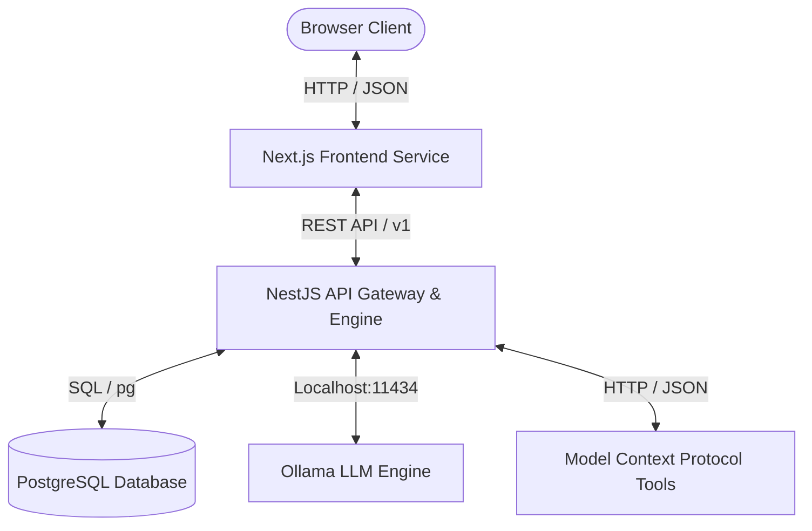
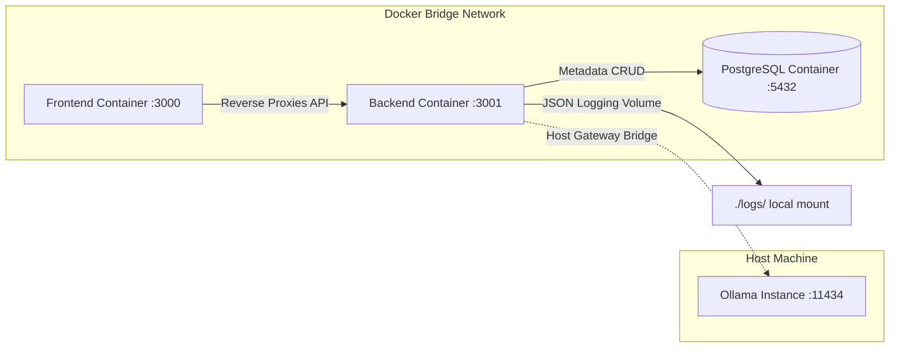
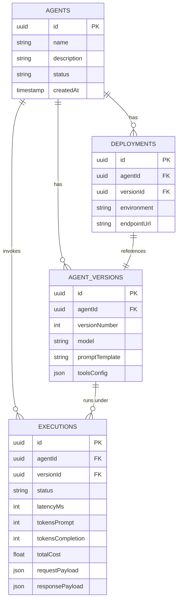

# AgentOS Architecture Design Document

AgentOS is an enterprise-grade AI Agent Control Plane designed to build, deploy, observe, and scale autonomous multi-agent systems. This document details the system topology, component interactions, request lifecycles, and the distributed span tracing engine.

---

## 1. High-Level System Architecture

AgentOS is composed of three containerized tiers communicating over isolated internal networks:



- **Client Tier**: A responsive React 19 / Next.js web application utilizing Tailwind CSS v4 and dynamic client-side CSS variable theme overrides.
- **Application Tier**: A modular NestJS REST backend coordinating agent execution, tracing telemetry, and tool orchestrations.
- **Data Tier**: PostgreSQL for persistent metadata storage and a local filesystem volume mount for granular raw execution JSON trace logs.

---

## 2. Dynamic Component Relationships

The application is deployed via `docker-compose` to enforce networking borders and volume boundaries:



### Component Breakdown
1. **Frontend (Port 3000)**: Serves static compiled pages. Connects dynamically to the backend API. Features an embedded, blocking theme-initialization script to mitigate layout color flashes (FOUC).
2. **Backend (Port 3001)**: Coordinates the multi-agent delegation protocols, executes tool schemas, writes logs to a mounted volume (`./logs`), and writes relational entities (executions, agents) to Postgres.
3. **Database (Port 5432)**: PostgreSQL instance tracking agent properties, version histories, deployment statuses, and latency/token aggregates.
4. **Ollama (Port 11434)**: Runs locally on the host's GPU/CPU. The backend container communicates through the Docker bridge gateway (`http://host.docker.internal:11434`).

---

## 3. Distributed Tracing & Execution Span Lifecycle

When an agent execution is triggered in the **Playground** or via API, the backend initiates a Jaeger-style parent-child trace hierarchy. Telemetry spans track processing execution blocks:

```mermaid
gantt
    title Agent Execution Distributed Spans (Sample Lifecycle)
    dateFormat  X
    axisFormat %s
    
    section Root Trace
    Root Execution (1100ms)      :active, trace, 0, 1100
    
    section Child Spans
    Reasoning / LLM Call (250ms) :done, llm1, 0, 250
    Tool execution: Web Search (400ms) :crit, active, tool1, 250, 650
    Sub-Agent Invocation: Writer (350ms) :done, agent1, 650, 1000
    Aggregation / Final LLM (100ms) :llm2, 1000, 1100
```

### Telemetry Spans Definition
- **`LLM_INFERENCE` (Reasoning/Planning)**: Captures prompt preparation, token parameters, model selection, raw completions, and token calculation metrics.
- **`TOOL_EXECUTION` (MCP/REST Tools)**: Measures external call latency, inputs (e.g. query strings), and tool outcomes (e.g. structured data payload).
- **`SUB_AGENT_INVOCATION` (Delegation)**: Represents nested child trace contexts when an agent routes tasks to sub-agents, tracing parent-to-child relationships recursively.

---

## 4. Database Schema Relationships



---

## 5. Architectural Slide Deck Highlights (For Presentation)

*Copy the key takeaways below directly into slide bullet points:*

*   **Hybrid Storage Paradigm**: Combines relational Postgres records (for fast dashboard metric aggregation and querying) with mounted workspace JSON log files (for durable, unindexed distributed span raw payloads).
*   **Zero-Dependency Dynamic Themes**: Next.js 16 layouts leverage direct Tailwind CSS v4 `@theme` mappings backed by client-side CSS variables. Theme shifts are performed completely in CSS variables, preventing heavy component re-renders.
*   **Host-to-Container Bridge**: Leverages standard Docker container gateways to bind high-compute neural network models running locally on the host's GPU via Ollama, matching containerized modularity with raw machine performance.
*   **Jaeger-Inspired Spans Engine**: Hierarchical child span injection maps exactly to multi-agent reasoning, sub-agent spawning, and tool executions, rendering granular Gantt-style tree diagrams on client browsers immediately.
