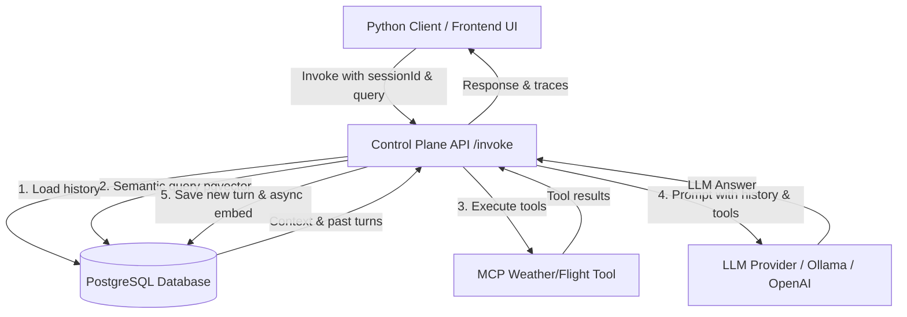

# RFC: Multi-Tenant State & Memory Architecture for AgentOS

## 1. Current State & Problem Statement

Currently, AgentOS runs a **fully stateless execution runtime**:
* Conversation history is stored entirely in the frontend React state (`PlaygroundForm.tsx`).
* When calling `POST /api/v1/agents/:id/invoke`, the execution engine only receives the single user message and a static system context.
* If a user refreshes the browser, redeploys an agent, or scales down a container service, the context is permanently lost.
* There is no backend mechanism for agents to remember details from previous turns (multi-turn conversation) or access past sessions.

To make AgentOS production-ready, we need to treat **State & Memory as a Platform-Level First-Class Citizen** instead of relying on ephemeral client-side payloads.

---

## 2. Proposed Architecture: Dual-Tier Memory System

We propose a dual-tier state persistence layer built directly into our existing PostgreSQL database, leveraging relational tables for **Short-Term Conversational Memory** and the `pgvector` extension for **Long-Term Semantic Memory**.



---

## 3. Short-Term Session Memory Design

Short-term memory tracks the sequential turns of a single conversation session. 

### Database Schema (TypeORM / SQL)

We introduce `Session` and `ChatMessage` entities:

```sql
CREATE TABLE "sessions" (
    "id" UUID PRIMARY KEY DEFAULT gen_random_uuid(),
    "agent_id" UUID REFERENCES "agents"("id") ON DELETE CASCADE,
    "user_id" VARCHAR(255) NOT NULL, -- Tenant / Client identifier
    "metadata" JSONB,
    "created_at" TIMESTAMP DEFAULT CURRENT_TIMESTAMP,
    "updated_at" TIMESTAMP DEFAULT CURRENT_TIMESTAMP
);

CREATE TABLE "chat_messages" (
    "id" UUID PRIMARY KEY DEFAULT gen_random_uuid(),
    "session_id" UUID REFERENCES "sessions"("id") ON DELETE CASCADE,
    "role" VARCHAR(50) NOT NULL, -- 'user' | 'assistant' | 'system' | 'tool'
    "content" TEXT NOT NULL,
    "name" VARCHAR(100), -- Tool name or sub-agent name
    "trace_id" VARCHAR(100), -- Maps to execution trace
    "created_at" TIMESTAMP DEFAULT CURRENT_TIMESTAMP
);
```

### Revised Execution Loop
When a developer calls `/invoke`:
1. **Request Payload:** The client passes `sessionId` (optional) and the query message.
2. **Retrieve Past Turns:** The control plane queries the database for the last `N` messages associated with the `sessionId`.
3. **Prompt Composition:** The history is structured into the model's standard chat template (System, User, Assistant, System, etc.) alongside live tool outputs.
4. **Write Turn:** Once the LLM responds, the Control Plane writes the user prompt and model response to `chat_messages` in a single transaction.

---

## 4. Long-Term Semantic Memory (RAG)

Relational history becomes expensive and noisy as conversations grow. We require a long-term semantic layer to store core memories, facts, and user preferences across multiple sessions.

### Implementation using `pgvector`
Instead of spinning up a separate vector database (which increases operational overhead, backup complexity, and cost), we enable `pgvector` inside our Postgres instance:

```sql
CREATE EXTENSION IF NOT EXISTS vector;

CREATE TABLE "agent_memories" (
    "id" UUID PRIMARY KEY DEFAULT gen_random_uuid(),
    "agent_id" UUID REFERENCES "agents"("id") ON DELETE CASCADE,
    "user_id" VARCHAR(255) NOT NULL,
    "session_id" UUID REFERENCES "sessions"("id") ON DELETE SET NULL,
    "content" TEXT NOT NULL,
    "embedding" vector(1536) NOT NULL, -- Dimensions matched to embedding model
    "created_at" TIMESTAMP DEFAULT CURRENT_TIMESTAMP
);

CREATE INDEX ON "agent_memories" USING hnsw (embedding vector_cosine_ops);
```

### Retrieval & Insertion Mechanics
* **Retrieval (Semantic Search):** Before executing the prompt, the agent generates an embedding of the user query and searches `agent_memories` for the top 3 closest items where `agent_id = :agentId AND user_id = :userId`. These facts are injected into the LLM system prompt.
* **Insertion (Memory Consolidation):** An asynchronous background job analyzes completed sessions, extracts key facts (e.g. *"User prefers Fahrenheit over Celsius"*), embeds them, and persists them into `agent_memories`.

---

## 5. Multi-Tenant Isolation & Security

In a multi-tenant platform where multiple corporate clients run agents, memory leakage between tenants is catastrophic.

We enforce isolation at the database layer using **PostgreSQL Row-Level Security (RLS)**:

```sql
-- Enable RLS on session and memory tables
ALTER TABLE sessions ENABLE ROW LEVEL SECURITY;
ALTER TABLE chat_messages ENABLE ROW LEVEL SECURITY;
ALTER TABLE agent_memories ENABLE ROW LEVEL SECURITY;

-- Define access policies based on tenant context
CREATE POLICY tenant_session_isolation ON sessions
    FOR ALL
    USING (user_id = current_setting('app.current_tenant_id', true));

CREATE POLICY tenant_memory_isolation ON agent_memories
    FOR ALL
    USING (user_id = current_setting('app.current_tenant_id', true));
```

During request bootstrapping in NestJS, a middleware reads the tenant credentials from the incoming auth header and sets the session-level PostgreSQL transaction variable `app.current_tenant_id`.

---

## 6. Why This is Crucial for Developers & Platforms

1. **Decoupled Compute & Storage:**
   If an agent container crashes or undergoes a rolling update, the user experiences zero interruption. The new container immediately picks up the session context from Postgres.
2. **Context Window Cost Optimization:**
   Instead of dumping the entire raw history to the LLM, the control plane can run sliding window compaction, summarization, or semantic vector retrieval, reducing prompt token costs by 40-70%.
3. **Pluggable Vector Memory:**
   Tool and agent builders can declare vector store dependencies inside their agent YAML files (e.g. `spec.memory.type: pgvector`), leaving provisioning and embedding pipeline coordination to AgentOS.
