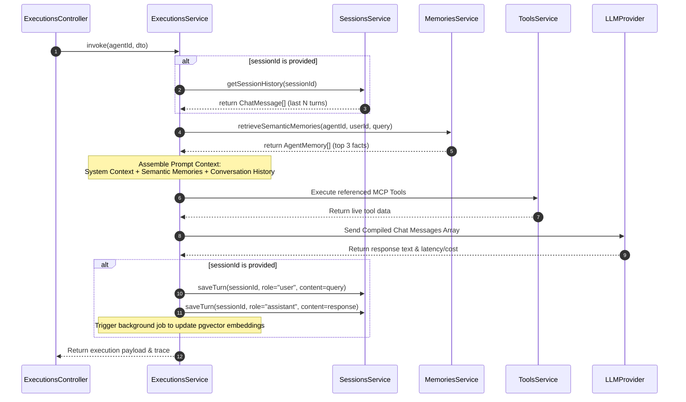

# Technical Specification: State & Memory Architecture

This document defines the implementation specifications for introducing a multi-tenant, dual-tier state and memory architecture in AgentOS.

---

## 1. Database Schema Specification

We will implement three new PostgreSQL tables: `sessions`, `chat_messages`, and `agent_memories`.

### TypeORM Entities (Representing DDL)

#### `Session` Entity (`backend/src/sessions/entities/session.entity.ts`)
Tracks individual conversational sessions mapped to agents and tenants.
```typescript
import { Entity, PrimaryGeneratedColumn, Column, CreateDateColumn, UpdateDateColumn, ManyToOne, OneToMany, JoinColumn } from 'typeorm';
import { Agent } from '../../agents/entities/agent.entity';
import { ChatMessage } from './chat-message.entity';

@Entity('sessions')
export class Session {
  @PrimaryGeneratedColumn('uuid')
  id: string;

  @Column({ name: 'agent_id' })
  agentId: string;

  @ManyToOne(() => Agent, { onDelete: 'CASCADE' })
  @JoinColumn({ name: 'agent_id' })
  agent: Agent;

  @Column({ name: 'user_id' })
  userId: string; -- Tenant identifier

  @Column({ type: 'jsonb', nullable: true })
  metadata: Record<string, any>;

  @CreateDateColumn({ name: 'created_at' })
  createdAt: Date;

  @UpdateDateColumn({ name: 'updated_at' })
  updatedAt: Date;

  @OneToMany(() => ChatMessage, (message) => message.session, { cascade: true })
  messages: ChatMessage[];
}
```

#### `ChatMessage` Entity (`backend/src/sessions/entities/chat-message.entity.ts`)
Stores sequential conversation turns.
```typescript
import { Entity, PrimaryGeneratedColumn, Column, CreateDateColumn, ManyToOne, JoinColumn } from 'typeorm';
import { Session } from './session.entity';

@Entity('chat_messages')
export class ChatMessage {
  @PrimaryGeneratedColumn('uuid')
  id: string;

  @Column({ name: 'session_id' })
  sessionId: string;

  @ManyToOne(() => Session, (session) => session.messages, { onDelete: 'CASCADE' })
  @JoinColumn({ name: 'session_id' })
  session: Session;

  @Column()
  role: string; -- 'user' | 'assistant' | 'system' | 'tool'

  @Column({ type: 'text' })
  content: string;

  @Column({ nullable: true })
  name: string; -- Stores the name of the tool or sub-agent if role is 'tool'

  @Column({ name: 'trace_id', nullable: true })
  traceId: string;

  @CreateDateColumn({ name: 'created_at' })
  createdAt: Date;
}
```

#### `AgentMemory` Entity (`backend/src/memories/entities/agent-memory.entity.ts`)
Stores vectorized semantic memories.
```typescript
import { Entity, PrimaryGeneratedColumn, Column, CreateDateColumn, ManyToOne, JoinColumn } from 'typeorm';
import { Agent } from '../../agents/entities/agent.entity';

@Entity('agent_memories')
export class AgentMemory {
  @PrimaryGeneratedColumn('uuid')
  id: string;

  @Column({ name: 'agent_id' })
  agentId: string;

  @ManyToOne(() => Agent, { onDelete: 'CASCADE' })
  @JoinColumn({ name: 'agent_id' })
  agent: Agent;

  @Column({ name: 'user_id' })
  userId: string;

  @Column({ type: 'text' })
  content: string;

  -- TypeORM custom column type for pgvector
  @Column({ type: 'text' })
  embedding: string; 

  @CreateDateColumn({ name: 'created_at' })
  createdAt: Date;
}
```

---

## 2. API Endpoints Specification

### 2.1. Sessions Management

* **`POST /api/v1/sessions`**
  * *Description:* Creates a new chat session.
  * *Payload:*
    ```json
    {
      "agentId": "uuid-here",
      "metadata": { "client": "playground-web" }
    }
    ```
  * *Response (201 Created):*
    ```json
    {
      "id": "session-uuid",
      "agentId": "uuid-here",
      "userId": "tenant-id",
      "createdAt": "2026-06-18T12:00:00Z"
    }
    ```

* **`GET /api/v1/sessions/:id/messages`**
  * *Description:* Fetches all chat messages in a session (sorted by `createdAt` ASC).
  * *Response (200 OK):*
    ```json
    [
      { "id": "msg-1", "role": "user", "content": "Hello", "createdAt": "..." },
      { "id": "msg-2", "role": "assistant", "content": "How can I help you?", "createdAt": "..." }
    ]
    ```

* **`DELETE /api/v1/sessions/:id`**
  * *Description:* Permanently deletes a session and its message logs.
  * *Response:* `204 No Content`

### 2.2. Updated Invocation endpoint

* **`POST /api/v1/agents/:id/invoke`**
  * *Payload:*
    ```json
    {
      "message": "User query prompt",
      "sessionId": "optional-session-uuid",
      "context": "optional static override prompt"
    }
    ```
  * *Response (200 OK):* Returns the agent's answer and the generated `executionId` and `trace`. If `sessionId` was provided, the turns are persisted in PostgreSQL.

---

## 3. Runtime Orchestration Logic

### Step-by-Step Invocation Execution Loop

When `POST /api/v1/agents/:id/invoke` is hit:



---

## 4. Multi-Tenant Row-Level Security Middleware

We will execute database connections within a transaction that sets the session context.

### NestJS Tenant Middleware (`backend/src/common/middleware/tenant.middleware.ts`)
```typescript
import { Injectable, NestMiddleware } from '@nestjs/common';
import { Request, Response, NextFunction } from 'express';
import { DataSource } from 'typeorm';

@Injectable()
export class TenantMiddleware implements NestMiddleware {
  constructor(private dataSource: DataSource) {}

  async use(req: Request, res: Response, next: NextFunction) {
    const tenantId = req.headers['x-tenant-id'] || 'default-tenant';
    req['tenantId'] = tenantId;
    
    -- Set connection context for current transaction
    const queryRunner = this.dataSource.createQueryRunner();
    await queryRunner.connect();
    await queryRunner.query(`SET LOCAL app.current_tenant_id = '${tenantId}'`);
    await queryRunner.release();

    next();
  }
}
```

---

## 5. Verification Plan

### Automated Tests
* **Integration Tests (`backend/test/sessions.e2e-spec.ts`):**
  * Create session -> verify creation.
  * Invoke agent with session ID -> verify chat messages list contains user message and agent response.
  * Invoke agent with different session ID -> verify isolation of conversation context.
  * Delete session -> verify database `sessions` and `chat_messages` count drops.
* **Tenant Security Tests (`backend/test/tenant-isolation.e2e-spec.ts`):**
  * Create session under `tenant-1`.
  * Retrieve session list using `tenant-2` header -> verify session list is empty (RLS validation).

### Manual Verification
1. Run Playground UI, choose an agent, and type multi-turn questions (e.g. *"My name is Cosmos"* followed by *"What is my name?"*).
2. Verify agent correctly recalls the state from the previous turn.
3. Refresh the browser and verify the conversation history is loaded back from the API using the `sessionId`.
