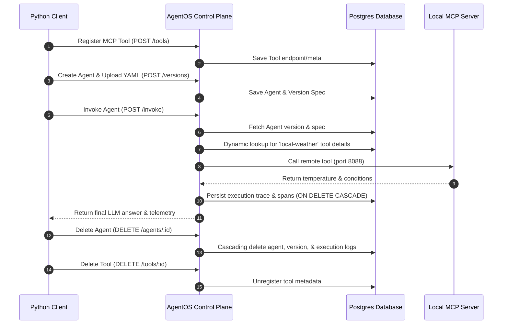

# AgentOS Dynamic Tool & Agent Lifecycle Demo

This example demonstrates how **AgentOS** manages the complete runtime lifecycle of AI agents and MCP tools dynamically. It registers an MCP tool, uploads a YAML assistant spec linking to the tool, invokes the assistant to run live inference and telemetry trace collection, and cleans up the resources using clean cascading deletes.

## Overview of the Lifecycle



## Running the Demo

1. Ensure the control plane backend is running on `http://localhost:3001` (e.g. via `docker compose up -d`).
2. Start the local weather MCP server (which runs on port `8088`):
   ```bash
   node examples/local-weather-mcp/mcp-server.js
   ```
3. Execute this demo script:
   ```bash
   python examples/mcp-dynamic-demo/run_demo.py
   ```

---

## Why Agent & Tool Developers Find This Architecture Useful

### 1. Zero Hardcoding (Production Readiness)
Traditional frameworks hardcode tools and agent parameters into source code. In AgentOS, all schemas, endpoint URLs, models, and specifications are saved as configuration data inside the relational database (Postgres). 
* **Tool devs** can register, upgrade, or swap MCP tool endpoints without redeploying the core NestJS control plane.
* **Agent devs** can deploy new agent version specs linking to different sets of tools instantly via YAML configuration.

### 2. Auto-Resolving MCP Execution Loop
The execution runtime parses the agent's spec, automatically resolves any tools requested by name in the database, extracts schema arguments dynamically, coordinates communication with remote MCP servers, and feeds the live results directly to the LLM. 

### 3. Bulletproof Cascading Cleanups
When deleting an agent, the backend handles cloud computing resources teardown (GCP, AWS, Azure compute) and cascades deletions down to local version histories, execution records, and nested telemetry spans. This guarantees:
* **Zero billing leakage** from orphaned cloud services.
* **Zero constraint exceptions** or DB trace leaks when deleting agents or tools.

### 4. Native Telemetry & Cost Accounting
Every tool call, reasoning step, and delegation event generates standard spans, tracking latency, status, token usage, and cost estimation automatically.
