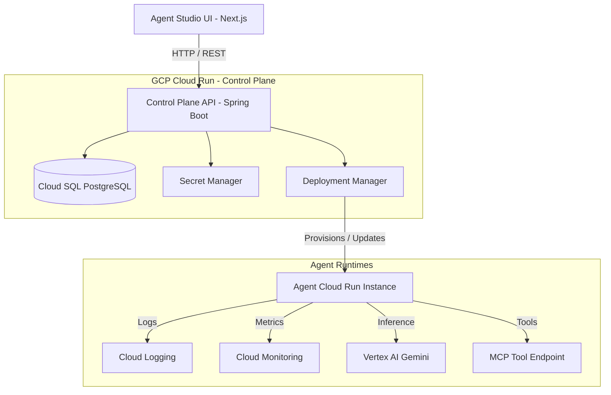

# AgentOS: Enterprise AI Agent Control Plane

AgentOS is a centralized control plane designed to build, version, deploy, observe, scale, and secure AI agents. It operates as the "Kubernetes/Vercel for AI Agents," abstracting infrastructure setup and standardizing operational practices for enterprise agent runtimes on Google Cloud Platform.

---

## User Review Required

> [!IMPORTANT]
> **Cloud Run Deployment Model**
> Every agent deployed creates a new Google Cloud Run service instance dynamically via the GCP API. This requires the backend Control Plane service account to have broad IAM permissions (`roles/run.admin`, `roles/iam.serviceAccountUser`). Please ensure that the GCP project is dedicated or highly sandboxed to prevent unauthorized service creation.

> [!WARNING]
> **MCP (Model Context Protocol) Networking**
> In the specification, tools use the MCP protocol. For deployed agents to call MCP tool endpoints safely, those endpoints must be either:
> 1. Exposed via secure internet endpoints (authenticated).
> 2. Deployed in the same GCP VPC (using VPC Access Connectors for Cloud Run).
> We propose deploying MCP services inside the same VPC and routing traffic internally.

---

## Open Questions

> [!IMPORTANT]
> 1. **Codebase Location**: Where should the AgentOS project source code live? Should it be initialized as a subdirectory (e.g., `agentos/` or `agentos-monorepo/`) inside the current repository `/Users/learnwithcosmos/repos/thecookieapp-project/cookie-app-rn` or should we set up a new directory/repository?
> 2. **Vertex AI Authentication**: Do you want the deployed agents to use the Cloud Run service identity (via GCP Metadata Service/Default Credentials) to authenticate with Vertex AI, or should we support user-provided GCP service account keys uploaded to Secret Manager?
> 3. **Streaming Requirement**: Does the agent execution endpoint `/invoke` require Server-Sent Events (SSE) streaming for all outputs, or is standard synchronous JSON execution sufficient for MVP Phase 1?

---

## Proposed Architecture



---

## Proposed Changes

We propose organizing AgentOS as a monorepo with the following components:

```text
agentos/
├── backend/            # Kotlin Spring Boot Application
├── frontend/           # Next.js UI (Agent Studio)
├── runtime-template/   # Kotlin Runtime Engine (Dockerized template for agents)
└── infra/              # Terraform/gcloud deployment scripts
```

Below are the detailed proposed changes for each component:

### Component 1: Database & Control Plane Core (PostgreSQL + Spring Boot)

We will set up a PostgreSQL database containing schemas for the Agent Registry, Versioning, Tool Registry, and Observability logs.

#### [NEW] [schema.sql](file:///Users/learnwithcosmos/repos/thecookieapp-project/cookie-app-rn/agentos/backend/src/main/resources/schema.sql)
Includes tables for agents, versions, deployments, tools, agent_tools, executions, and audits:
```sql
CREATE TABLE agents (
    id UUID PRIMARY KEY DEFAULT gen_random_uuid(),
    name VARCHAR(255) NOT NULL UNIQUE,
    description TEXT,
    owner VARCHAR(255) NOT NULL,
    created_at TIMESTAMP WITH TIME ZONE DEFAULT CURRENT_TIMESTAMP,
    updated_at TIMESTAMP WITH TIME ZONE DEFAULT CURRENT_TIMESTAMP
);

CREATE TABLE agent_versions (
    id UUID PRIMARY KEY DEFAULT gen_random_uuid(),
    agent_id UUID NOT NULL REFERENCES agents(id) ON DELETE CASCADE,
    version INT NOT NULL,
    definition JSONB NOT NULL,
    status VARCHAR(50) NOT NULL, -- DRAFT, ACTIVE, ROLLBACK, DEPRECATED
    created_at TIMESTAMP WITH TIME ZONE DEFAULT CURRENT_TIMESTAMP,
    UNIQUE(agent_id, version)
);

CREATE TABLE agent_deployments (
    id UUID PRIMARY KEY DEFAULT gen_random_uuid(),
    version_id UUID NOT NULL REFERENCES agent_versions(id),
    environment VARCHAR(50) NOT NULL, -- staging, production
    deployment_status VARCHAR(50) NOT NULL, -- PENDING, IN_PROGRESS, ACTIVE, FAILED
    endpoint_url VARCHAR(1024),
    deployed_at TIMESTAMP WITH TIME ZONE DEFAULT CURRENT_TIMESTAMP
);

CREATE TABLE tools (
    id UUID PRIMARY KEY DEFAULT gen_random_uuid(),
    name VARCHAR(255) NOT NULL UNIQUE,
    description TEXT,
    protocol VARCHAR(50) NOT NULL, -- MCP, REST
    endpoint VARCHAR(1024) NOT NULL,
    created_at TIMESTAMP WITH TIME ZONE DEFAULT CURRENT_TIMESTAMP
);

CREATE TABLE agent_tools (
    agent_id UUID NOT NULL REFERENCES agents(id) ON DELETE CASCADE,
    tool_id UUID NOT NULL REFERENCES tools(id) ON DELETE CASCADE,
    PRIMARY KEY(agent_id, tool_id)
);

CREATE TABLE executions (
    id UUID PRIMARY KEY DEFAULT gen_random_uuid(),
    agent_id UUID NOT NULL REFERENCES agents(id),
    version_id UUID NOT NULL REFERENCES agent_versions(id),
    request_payload JSONB,
    response_payload JSONB,
    latency_ms INT,
    tokens_prompt INT,
    tokens_completion INT,
    total_cost DECIMAL(10, 6),
    status VARCHAR(50) NOT NULL, -- SUCCESS, FAILED
    created_at TIMESTAMP WITH TIME ZONE DEFAULT CURRENT_TIMESTAMP
);
```

#### [NEW] [AgentController.kt]
Spring Boot REST Controller exposing Agent lifecycle endpoints:
- `POST /api/v1/agents` - Create agent entry
- `GET /api/v1/agents` - List agents
- `POST /api/v1/agents/{id}/versions` - Upload and validate new YAML specification
- `POST /api/v1/agents/{id}/deploy` - Trigger GCP Cloud Run deployment for a version
- `POST /api/v1/agents/{id}/rollback` - Revert to a previous active version
- `GET /api/v1/agents/{id}/metrics` - Query aggregated metrics from execution tables

---

### Component 2: Deployment Manager

This component is responsible for orchestrating GCP APIs (Cloud Run, IAM, Secret Manager) to deploy agent containers.

#### [NEW] [DeploymentService.kt]
Interacts with the Google Cloud Run API client:
- Creates or updates a Cloud Run Service using the configured scaling profile (`minReplicas`, `maxReplicas`).
- Configures environment variables (e.g., `AGENT_DEFINITION`, `POSTGRES_DB_CONN`) on the target container.
- Hooks up Cloud Run Service Accounts with appropriate Google IAM bindings (e.g. Vertex AI access).
- Polls Cloud Run deployment state and updates `agent_deployments` status.

---

### Component 3: Runtime Template

This is the standard execution template deployed onto Cloud Run for every agent. It runs a lightweight Spring WebFlux Kotlin application.

#### [NEW] [Agent.kt]
Main execution core:
```kotlin
package com.agentos.runtime

interface Agent {
    suspend fun execute(request: AgentRequest): AgentResponse
}
```

#### [NEW] [GeminiModelAdapter.kt]
Adapter connecting to GCP Vertex AI using the Vertex AI SDK. Handles system prompts, temperature configs, and structures model outputs.

#### [NEW] [McpToolRegistryClient.kt]
Client that speaks Model Context Protocol (MCP) to resolve tool schemas and delegate execution requests from the LLM dynamically.

---

### Component 4: Agent Studio (Next.js Frontend)

Built with Next.js App Router, Tailwind CSS, and shadcn/ui.

#### [NEW] [page.tsx]
Observability Dashboard displaying cost, active agents, success rate, and latency.

#### [NEW] [page.tsx]
Agent Registry explorer where users can review agent versions, configuration YAMLs, deployments, and trigger deployments/rollbacks.

#### [NEW] [playground.tsx]
An interactive chat-playground to test and debug deployed agents directly in the UI with execution tracing.

---

## Verification Plan

### Automated Tests
- **Backend Unit & Integration Tests**:
  - Run Spring Boot tests: `./gradlew test` (verifies agent schema validations, YAML parsing, and DB service layers).
  - Use MockWebServer to test GCP Cloud Run provisioning calls and MCP requests.
- **Frontend E2E Tests**:
  - Test UI transitions and form validations using Playwright.

### Manual Verification
1. **Mock Deployments**: Verify that the Control Plane successfully generates correct JSON configs from local YAML files.
2. **Cloud Run Mock Deployment**: Deploy runtime template using a local script and ensure it responds properly on the `/health` and `/execute` endpoints.
3. **End-to-End Local Execution**: Boot PostgreSQL, Spring Boot backend, Next.js frontend, and a local MCP tool container using Docker Compose. Deploy an agent definition locally, invoke it via the playground, and check that executions are logged correctly in the database dashboard.
